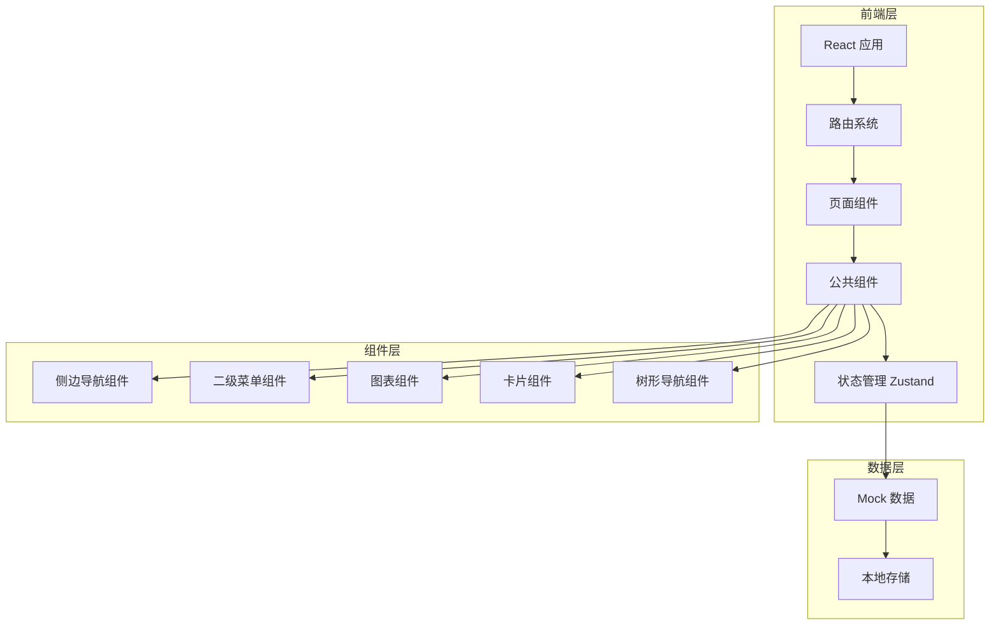

# 能耗监测系统 - 技术架构文档

## 1. 架构设计



## 2. 技术说明

- **前端框架**：React 18 + TypeScript
- **样式方案**：Tailwind CSS 3
- **构建工具**：Vite
- **状态管理**：Zustand
- **图表库**：Recharts（轻量级，适合数据可视化）
- **图标库**：Lucide React
- **路由库**：React Router DOM 6
- **后端服务**：无（使用 Mock 数据模拟）

## 3. 路由定义

| 路由 | 用途 | 页面内容 |
|-----|-----|---------|
| `/` | 重定向到能源驾驶舱 | - |
| `/dashboard` | 能源驾驶舱 | 电/水能耗统计卡片、趋势图、设备树 |
| `/electric/overview` | 用电概况 | 用电数据概览、分布图、趋势图 |
| `/electric/yoy` | 用电同比分析 | 同比对比数据和图表 |
| `/electric/mom` | 用电环比分析 | 环比对比数据和图表 |
| `/electric/trend` | 用电趋势 | 详细趋势图表和数据表格 |
| `/water` | 用水分析 | 仅菜单，无页面内容 |
| `/water/overview` | 用水概况 | 仅菜单，无页面内容 |
| `/water/yoy` | 用水同比分析 | 仅菜单，无页面内容 |
| `/water/mom` | 用水环比分析 | 仅菜单，无页面内容 |
| `/water/trend` | 用水趋势 | 仅菜单，无页面内容 |
| `/statistics/trend` | 能耗趋势分析 | 多维度趋势对比图 |
| `/statistics/team` | 班组分析 | 班组能耗对比图 |
| `/statistics/product` | 单品能耗 | 产品能耗指标分析 |
| `/statistics/process` | 工艺能耗 | 工艺流程能耗分析 |
| `/report` | 报表管理 | 仅菜单，无页面内容 |
| `/device` | 设备管理 | 仅菜单，无页面内容 |
| `/alarm` | 告警管理 | 仅菜单，无页面内容 |
| `/system` | 系统管理 | 仅菜单，无页面内容 |

## 4. 数据模型

### 4.1 菜单结构

```typescript
interface MenuItem {
  id: string;
  name: string;
  icon: string;
  path: string;
  children?: MenuItem[];
  hasContent: boolean;  // 是否有页面内容
}
```

### 4.2 设备树节点

```typescript
interface TreeNode {
  id: string;
  name: string;
  type: 'factory' | 'workshop' | 'equipment' | 'meter';
  parentId: string | null;
  children: TreeNode[];
  icon?: string;
}
```

### 4.3 能耗统计数据

```typescript
interface EnergyStats {
  type: 'electric' | 'water';
  current: number;         // 当前用量
  previous: number;         // 同期用量
  changePercent: number;    // 变化百分比
  changeValue: number;      // 变化值
  unit: string;             // 单位
  period: 'today' | 'month' | 'year';
}
```

### 4.4 趋势数据

```typescript
interface TrendData {
  time: string;
  value: number;
  compareValue?: number;  // 对比数据
}

interface TrendDataPoint {
  date: string;
  electric: number;
  water: number;
}
```

### 4.5 分析数据

```typescript
interface AnalysisData {
  currentPeriod: {
    start: string;
    end: string;
    total: number;
    avg: number;
    peak: number;
  };
  comparePeriod: {
    start: string;
    end: string;
    total: number;
    avg: number;
    peak: number;
  };
  changePercent: number;
  changeValue: number;
}
```

### 4.6 班组能耗

```typescript
interface TeamEnergyData {
  teamId: string;
  teamName: string;
  totalEnergy: number;
  output: number;           // 产量
  energyPerUnit: number;    // 单位能耗
  rank: number;
}
```

### 4.7 产品能耗

```typescript
interface ProductEnergyData {
  productId: string;
  productName: string;
  batchNo: string;
  totalEnergy: number;
  output: number;
  energyPerUnit: number;
  stages: {
    name: string;
    energy: number;
    percent: number;
  }[];
}
```

### 4.8 工艺能耗

```typescript
interface ProcessEnergyData {
  processId: string;
  processName: string;
  stages: {
    id: string;
    name: string;
    energy: number;
    duration: number;
    efficiency: number;
  }[];
  totalEnergy: number;
}
```

## 5. 项目结构

```
/workspace
├── src/
│   ├── components/          # 公共组件
│   │   ├── Layout/         # 布局组件（侧边导航、二级菜单）
│   │   ├── Sidebar/        # 侧边导航组件
│   │   ├── SubMenu/        # 二级菜单组件
│   │   ├── TreeNav/        # 树形导航组件（仅查看，无编辑功能）
│   │   ├── StatCard/       # 统计卡片组件
│   │   ├── Chart/          # 图表组件
│   │   │   ├── LineChart/  # 折线图
│   │   │   ├── PieChart/   # 饼图
│   │   │   ├── BarChart/   # 柱状图
│   │   │   └── AreaChart/  # 面积图
│   │   ├── DataTable/      # 数据表格组件
│   │   └── TimeSelector/   # 时间选择器
│   ├── pages/              # 页面组件
│   │   ├── Dashboard/      # 能源驾驶舱
│   │   ├── Electric/       # 用电分析
│   │   │   ├── Overview/   # 用电概况
│   │   │   ├── YoyAnalysis/# 同比分析
│   │   │   ├── MomAnalysis/# 环比分析
│   │   │   └── Trend/      # 用电趋势
│   │   └── Statistics/     # 能耗统计
│   │       ├── TrendAnalysis/ # 趋势分析
│   │       ├── TeamAnalysis/  # 班组分析
│   │       ├── ProductEnergy/ # 单品能耗
│   │       └ ProcessEnergy/ # 工艺能耗
│   ├── hooks/              # 自定义Hooks
│   │   ├── useEnergyData.ts
│   │   ├── useTreeData.ts
│   │   └── useChartData.ts
│   ├── store/              # Zustand状态管理
│   │   ├── menuStore.ts    # 菜单状态
│   │   ├── treeStore.ts    # 设备树状态（仅选中状态）
│   │   └ energyStore.ts   # 能耗数据状态
│   ├── utils/              # 工具函数
│   │   ├── format.ts       # 数据格式化
│   │   ├── calculate.ts    # 计算函数
│   │   └ date.ts          # 日期处理
│   ├── data/               # Mock数据
│   │   ├── menuData.ts     # 菜单数据
│   │   ├── treeData.ts     # 设备树数据
│   │   ├── energyData.ts   # 能耗数据
│   │   ├── trendData.ts    # 趋势数据
│   │   └ analysisData.ts # 分析数据
│   ├── types/              # TypeScript类型定义
│   │   ├── menu.ts
│   │   ├── tree.ts
│   │   ├── energy.ts
│   │   └ chart.ts
│   ├── App.tsx             # 应用入口
│   ├── main.tsx            # 主入口文件
│   └── index.css           # 全局样式
├── api/                    # 预留后端目录（暂不使用）
└── .trae/documents/        # 项目文档
```

## 6. 核心功能实现

### 6.1 菜单导航系统

- **一级菜单**：固定在左侧边栏，包含8个主要模块入口
- **二级菜单**：根据一级菜单动态显示对应的子菜单Tab
- **路由联动**：点击菜单自动切换路由，更新页面内容
- **状态同步**：使用Zustand管理菜单展开/选中状态

### 6.2 设备树导航

- **节点选择**：点击节点高亮显示，更新右侧数据
- **节点展开/收起**：点击展开/收起按钮切换子节点显示
- **仅查看功能**：无新增、编辑、删除操作，仅用于选择查看数据

### 6.3 数据可视化

- **统计卡片**：展示关键指标，使用动画数字效果
- **趋势图**：使用Recharts绘制平滑曲线图，支持多数据对比
- **分布图**：饼图展示各区域能耗占比
- **对比图**：柱状图展示班组/产品能耗对比

### 6.4 交互设计

- 图表支持hover显示详细数据
- 数据表格支持排序和筛选
- 时间选择器支持切换查看不同时间段数据
- 菜单切换有过渡动画

## 7. 菜单配置数据

```typescript
const menuData: MenuItem[] = [
  {
    id: 'dashboard',
    name: '能源驾驶舱',
    icon: 'LayoutDashboard',
    path: '/dashboard',
    hasContent: true
  },
  {
    id: 'electric',
    name: '用电分析',
    icon: 'Zap',
    path: '/electric',
    hasContent: true,
    children: [
      { id: 'electric-overview', name: '用电概况', path: '/electric/overview', hasContent: true },
      { id: 'electric-yoy', name: '同比分析', path: '/electric/yoy', hasContent: true },
      { id: 'electric-mom', name: '环比分析', path: '/electric/mom', hasContent: true },
      { id: 'electric-trend', name: '用电趋势', path: '/electric/trend', hasContent: true }
    ]
  },
  {
    id: 'water',
    name: '用水分析',
    icon: 'Droplets',
    path: '/water',
    hasContent: false,
    children: [
      { id: 'water-overview', name: '用水概况', path: '/water/overview', hasContent: false },
      { id: 'water-yoy', name: '同比分析', path: '/water/yoy', hasContent: false },
      { id: 'water-mom', name: '环比分析', path: '/water/mom', hasContent: false },
      { id: 'water-trend', name: '用水趋势', path: '/water/trend', hasContent: false }
    ]
  },
  {
    id: 'statistics',
    name: '能耗统计',
    icon: 'BarChart3',
    path: '/statistics',
    hasContent: true,
    children: [
      { id: 'statistics-trend', name: '趋势分析', path: '/statistics/trend', hasContent: true },
      { id: 'statistics-team', name: '班组分析', path: '/statistics/team', hasContent: true },
      { id: 'statistics-product', name: '单品能耗', path: '/statistics/product', hasContent: true },
      { id: 'statistics-process', name: '工艺能耗', path: '/statistics/process', hasContent: true }
    ]
  },
  {
    id: 'report',
    name: '报表管理',
    icon: 'FileText',
    path: '/report',
    hasContent: false
  },
  {
    id: 'device',
    name: '设备管理',
    icon: 'Settings',
    path: '/device',
    hasContent: false
  },
  {
    id: 'alarm',
    name: '告警管理',
    icon: 'Bell',
    path: '/alarm',
    hasContent: false
  },
  {
    id: 'system',
    name: '系统管理',
    icon: 'Cog',
    path: '/system',
    hasContent: false
  }
];
```